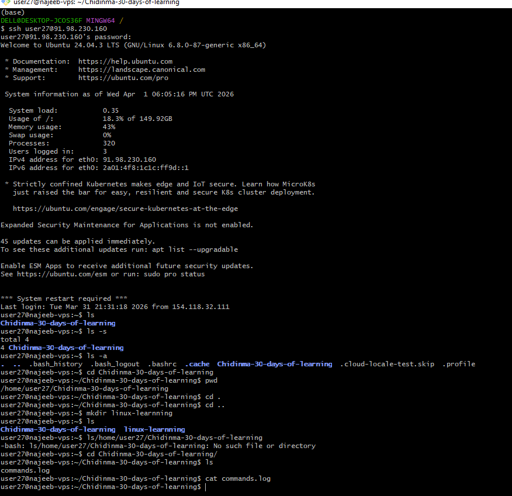
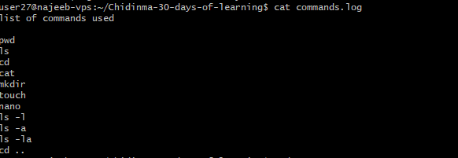
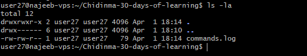

# Day 01 - [Linux Fundamentals and Architecture]

---

## Objective

The goal for today is 

By the end of today, I should be able to:

- Understand the core Linux concept
- Understanding the Linux architecture
- Open and use the terminal confidently
- Navigate the file system
- Understand basic terminal commands 

---

## What I Learned

- Introduction to Linux as an open-source operating system widely used in servers and cloud environments
- Understanding the core components of Linux architecture:
    - Kernel – the core of the OS that manages hardware and system resources
    - Shell – the interface that allows users to interact with the system via commands
    - Terminal – the environment used to access the shell
- Overview of Linux fundamentals and how it differs from other operating systems
- Key differences between Linux and Windows in terms of:
    - System structure
    - User interaction (CLI vs GUI emphasis)
    - Flexibility and control

---

## What I Built / Practiced

- Created a working directory: ```mkdir chidinma-30-days-of-learning```
- Created a file: commands.logs to store executed commands using the ```touch``` command
- Navigated directories using basic Linux commands ```cd```
- Explored file listing using ```ls``` and the various flags -a, -l
- Explored directory structure using pwd
- view file content using ```cat``` and navigating the file editor using ```nano```


---

## Key Takeaways

- Linux is structured in a hierarchical file system starting from the root (/)
- The terminal is a powerful tool for interacting with the system than using the GUI 
- Understanding the relationship between the kernel, shell, and terminal is essential
- Command-line proficiency is essential for working in real-world engineering environments

---

## Resources 

https://www.geeksforgeeks.org/linux-unix/introduction-to-linux-operating-system/

https://www.youtube.com/watch?v=ZtqBQ68cfJc

---

## Output

**commands executed**

- mkdir =  to make directory / folder
- pwd = print working directory
- ls =  list content in a folder
- ls -la =  more detailed list
- cd = navigate to a folder or directory
- cat =  view content in a file
- nano =  to write in a file

Commands screenshots




