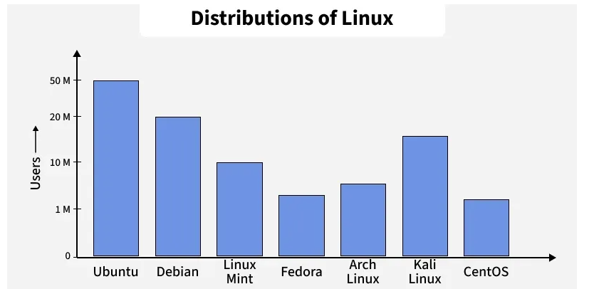
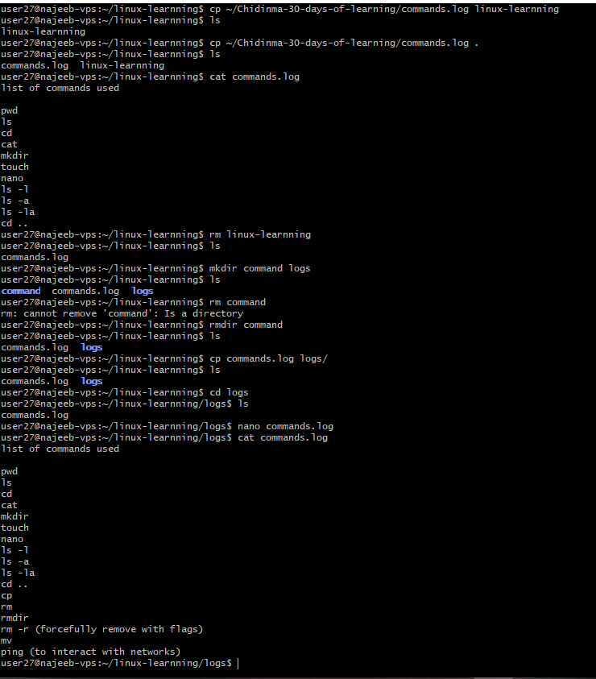

# Day 02 - Understanding Linux Ecosystem and Architecture

## Objective

The goal for today was to deepen my understanding of Linux by exploring its foundational concepts, ecosystem, and internal structure.

By the end of today, I should be able to:

- Understand what Linux is and how it works  
- Explain the concept of Linux distributions  
- Identify and choose appropriate Linux distributions based on use case  
- Understand Linux system architecture in more depth  
- Clearly differentiate between Linux and Unix  

---

## What I Learned

Linux is an open-source operating system inspired by UNIX, designed for multi-user and      multitasking environments. It is widely used across servers, cloud platforms, embedded systems, and development environments due to its performance, security, and flexibility  

### Linux Distributions

A Linux distribution is a complete operating system built around the Linux kernel Linux kernel, bundled with essential software, tools, and package managers, customized to serve different users like developers, enterprises, cybersecurity professionals, and general users.

- Includes the Linux kernel, system tools, package manager, and optional desktop environment.
- Comes with pre-installed tools, reducing manual setup.
- Built for different purposes like hacking, servers, development, or desktop use.
- Offers flexibility and customization based on user needs.

**Examples:**

- Ubuntu – Beginner-friendly and widely used  
- Debian – Stable and reliable  
- Fedora – Cutting-edge for developers  
- Kali Linux – Security and penetration testing  
- Linux Mint – User-friendly alternative for Windows users  

### Linux Architecture (Deeper Understanding)

- **Kernel** – Core of the OS that manages hardware, processes, and memory  
- **System Libraries** – Provide functions that allow applications to interact with the kernel  
- **Shell** – Interface that interprets and executes user commands  
- **Hardware Layer** – Physical components like CPU, RAM, and storage  
- **System Utilities** – Tools used for system management and maintenance  

### Linux vs Unix

- Linux is open-source and community-driven, while Unix is mostly proprietary and close source
- Linux is free to use, whereas Unix systems are typically licensed  
- Linux offers greater flexibility and customization  
- Unix is commonly used in enterprise and legacy systems 

**Key Insight:**  
Linux is Unix-like but not Unix. It follows similar design principles while remaining open-source.

### Importance and Applications of Linux

- Widely used in servers and cloud computing  
- Supports software development and DevOps workflows  
- Used in cybersecurity (e.g., penetration testing and ethical hacking)  
- Powers embedded systems and IoT devices 
- Fully open-source and free to use, modify, and distribute. 
- Runs most supercomputers globally  
- Supported by a large global community and a vast software ecosystem.
---

## What I Built / Practiced

- Studied and documented Linux foundational concepts  
- Explored different Linux distributions and their use cases  
- Compared Linux vs Unix in detail  
- Reviewed Linux architecture and system components  
- Gained exposure to basic Linux commands and package managers (`apt`, `dnf`) 
- worked on some basic linux commands

---

## Challenges Faced

- Understanding the deeper relationship between Linux architecture components  
- While copying my commands.log file into the linux-learnning folder, I initially encountered an issue due to misunderstanding path usage and syntax in the cp command. My first attempt accidentally created a file with the folder’s name instead of copying the file into the folder.

---

## Key Takeaways

- Linux is a critical skill for careers in data, cloud, and DevOps  
- Understanding distributions helps in selecting the right environment  
- Linux architecture is modular and enables flexibility and efficiency  
- Linux vs Unix is a foundational concept for system-level understanding  
- Strong theoretical knowledge is essential before deep hands-on practice  
- When using Linux commands, ensure proper spacing and accurate path specification
---

## Resources

- GeeksforGeeks Linux Tutorial  
  https://www.geeksforgeeks.org/linux-unix/linux-tutorial/

---

## Output

### Basic Linux commands learnt

- cp -used to copy files respectively or directories
- mv - used to move files 
- rm - used to remove files not needed 
- rmdir - to delete an empty directories
- rm -r - delete directories and all it content
- ping - use to check network connections

