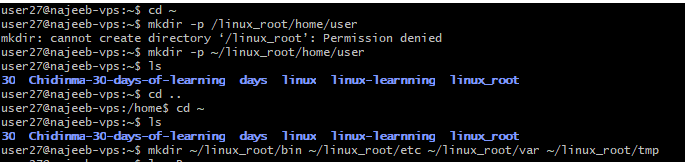
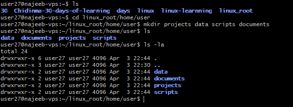

# Day 03 - Linux File System & Directory Management

## Objective

The goal for today is to **understand the Linux file system hierarchy** and **practice directory creation, navigation, and file management** in a simulated environment.  

By the end of today, I should be able to:

- Understand Linux file hierarchy and directory structure  
- Navigate using **absolute and relative paths**  
- Create, organize, and manage directories and files safely  
- Apply previously learned commands in practical workflows  

---

## What I Learned

- Linux uses a **hierarchical file system**, starting from root (`/`).  
- **Absolute and relative paths** are key for navigation in nested directories.  
- Common directories include `/bin`, `/etc`, `/var`, `/tmp`, and `/home`.  
- Combining commands like `mkdir`, `touch`, `cp`, `mv`, and `rm` allows you to **organize directories and files efficiently**.  
- Practicing in a **simulated home directory** avoids using `sudo` while giving full control for exercises.  
 

---

## What I Practiced

- Created a **sandbox Linux environment** in `~/linux_root`  
- Created subdirectories: `project`, `scripts`, `data`, `documents`  
- Added sample files in each directory  
- Practiced **navigation using absolute and relative paths**  
- Practiced **moving, copying, and removing files** safely  
---

## Challenges Faced

- Understanding when to use absolute paths (~/linux_root/...) vs relative paths (../, ./) while moving between directories

---

## Key Takeaways

- Linux file system is **hierarchical and logical**; understanding it is crucial for navigation  
- Absolute and relative paths enable efficient directory traversal  
- Organizing directories and files in practice prepares for **permissions and ownership**
---

## Resources

- [GeeksforGeeks Linux Tutorial](https://www.geeksforgeeks.org/linux-unix/linux-tutorial/)  
- [YouTube – Linux File System Explained](https://www.youtube.com/watch?v=995-SYn6960)  

---

## Output

### Key Commands 

| Command | Purpose / Usage |
|---------|----------------|
| `pwd` | Show current directory |
| `ls` | List contents |
| `ls -la` | List all files including hidden files |
| `cd <directory>` | Navigate into a directory |
| `cd ..` | Move one level up |
| `mkdir <directory>` | Create a new directory |
| `mkdir -p <path/to/directory>` | Create nested directories at once |
| `touch <file>` | Create an empty file |
| `cp <source> <destination>` | Copy files |
| `cp -r <source_dir> <destination_dir>` | Copy directories recursively |
| `mv <source> <destination>` | Move or rename files/directories |
| `rm <file>` | Remove a file |
| `rm -r <directory>` | Remove a directory recursively |

### Practical steps

- Create sandbox directories in my home directory
`mkdir -p ~/linux_root/home/linux_user`

- craete a linux system structure subdirectories 
`mkdir ~/linux_root/bin ~/linux_root/etc ~/linux_root/var ~/linux_root/tmp`

- Create project folders
`cd ~/linux_root/home/linux_user`
`mkdir project scripts data documents`

- Add sample files

`touch project/main.txt project/README.md`

`touch scripts/scripts.sh scripts/clean_scripts.sh`

`touch data/dataset.csv data/dataset.json data/dataset1_backup.csv data/dataset.parquest`

`touch documents/notes.txt documents/doc.png`

- navigate through the folders

`cd ~/linux_root/home/linux_user/project`
    - pwd
    - ls
    - cd ../scripts
    - pwd
    - ls
    - cd ../../..

- Move and copy files
`cp data/dataset1.csv data/dataset1_backup.csv`
`mv scripts/cleanup.sh scripts/old_cleanup.sh`

# Remove files

rm data/dataset2.csv

rm -r tmp/

