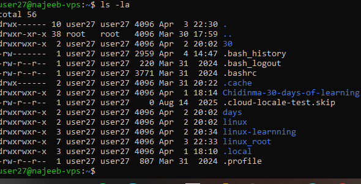
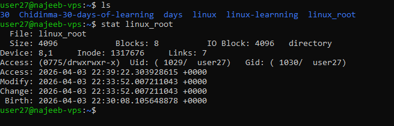
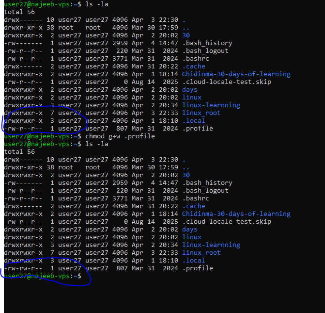

# Day 04 - [Permission In Linux and Ownership] 

## Objective

The goal for today is to understand how Linux controls access to files and directories using permissions and ownership.

By the end of today, I should be able to:

- Understand Linux file permissions (read, write, execute)
- Identify permission groups (user, group, others)
- Check file permissions using commands
- Modify permissions using `chmod`
- Understand ownership and modify it using `chown`

---

## What I Learned

The goal for today is to understand how Linux controls access to files and directories using permissions and ownership.

By the end of today, I should be able to:

- Understand Linux file permissions (read, write, execute)
- Identify permission groups (user, group, others)
- Check file permissions using commands
- Modify permissions using `chmod`
- Understand ownership and modify it using `chown`

### Permission Groups

Permissions are applied to three categories:

- **User (u)** – The owner of the file  
- **Group (g)** – Users in the same group  
- **Others (o)** – All other users  

example:

`-rw-r--r--`

- First character: file type (`-` = file, `d` = directory)  
- Next 3: owner permissions  
- Next 3: group permissions  
- Last 3: others permissions 

### Checking File Permissions

Used the following commands:

- ls -l filename
- stat filename
- namei -l /path/to/file

example: 

`-rw-r--r-- 1 user group 46 Apr 14 16:37 file.txt`

### Changing Permissions with chmod

Used chmod to modify file permissions.

*Symbolic Method*

`chmod +x file.sh`        # add execute

`chmod -w file.txt`       # remove write

`chmod u+rwx file.txt`   # give full permission to user

`chmod ug+rw,o-x file`   # multiple changes

- Octal Method

*Permission	Value*
- r	= 4
- w	= 2
- x	= 1

Example:

`chmod 755 script.sh`

Breakdown:

- Owner → 7 (rwx)
- Group → 5 (r-x)
- Others → 5 (r-x)

### File Ownership

Linux assigns ownership to every file.

- User (Owner)
- Group

Used **chown** to modify ownership:

- chown user file.txt
- chown :group file.txt
- chown user:group file.txt

## What I Practiced

- Checked file permissions using ls -l
- Interpreted permission strings (e.g., -rw-r--r--)
- Modified permissions using both:
- Symbolic notation (chmod u+x)
- Octal notation (chmod 755)
- Made a script executable using chmod +x
- Verified permission changes after modification
- Explored ownership structure using chown (conceptually, due to limited permissions in VM) 

---

## Challenges Faced

- Understanding how to interpret permission strings like rwxr-xr-
- Limited ability to fully practice chown due to lack of sudo/root access

---

## Key Takeaways

- Linux permissions are the foundation of system security
- Every file has three permission layers: user, group, others
- chmod is used to control access, while chown manages ownership
- Understanding permissions is critical for working in real-world Linux environments

---

## Resources

https://www.geeksforgeeks.org/linux-unix/chmod-command-linux/

https://www.geeksforgeeks.org/linux-unix/chown-command-in-linux-with-examples/

https://www.geeksforgeeks.org/linux-unix/chmod-command-linux/
---

## Output

