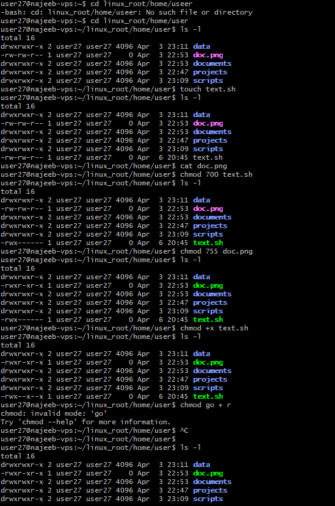
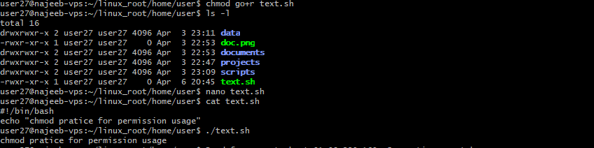

# Day 06 - Linux File Permissions (chmod Deep learning)

## Objective

To gain a solid and practical understanding of Linux file permissions by focusing specifically on the chmod command and how it controls access to files and scripts.

---

## What I Learned
- Linux file permission are divided into three permission groups
    - users
    - groups
    - orders

- in Linux we have three main permission types that defines how a file can be accessed or modified 
    - read (r) - read the content of the file
    - write (w) - modify or edit the file content
    - execute (x) - it excute the content in a file or list content in directories

- the chmod command is used to modify this permission using:
    - Numeric (octal) mode e.g 755 , 644
    - Symbolic mode  e.g u+x, ugo+r, o-w

- Numneric values that represent the permission are:
    - read (r) = 4
    - write(w) = 2
    - execute (x) = 1

- assigning a permission to user required the (+) sign. then denying access to a user requires the (-) sign
---

## What I Practiced

-   Praticed changing permission using Numeric and symbolic mode
    - for symbolic mode we have it as 
        - chmod go+x text.sh
    - for numeric mode we have it as
        - chmod 754 text.sh

- created and executed a shell scripts 

    #!/bin/bash
    echo "chmod pratice for permission usage"

    save and exit from the file editor

- ckeck for permission using ls -l (using the -l flag)

- execute the scrite using 

    `./text.sh`

---

## Challenges Faced

- Earlier exposure to permissions (in Week 4) without deep understanding made it initially confusing.

- Translating numeric values (e.g., 755) into actual permission sets required repeated practice

---

## Key Takeaways

- Focusing deeply on one concept (chmod) improved clarity significantly.
- Numeric and symbolic modes serve the same purpose but offer different levels of control.
- Execute permission (+x) is critical for running scripts in Linux.
- Mastery of file permissions is essential for system security and script execution workflows

---

## Resources

- https://www.geeksforgeeks.org/linux-unix/chmod-command-linux/

---

## Output

