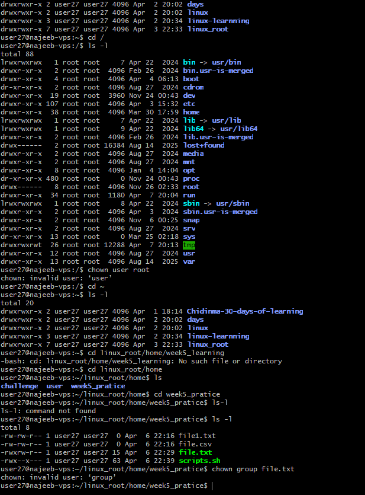

# Day 07 - Linux File Ownership (chown Overview)

## Objective

To understand how file ownership works in Linux and how the chown command is used to manage ownership of files and directories.

---

## What I Learned

- Every file in Linux has an associated owner and group.
- Ownership determines who has control over a file and how permissions are applied.
- The chown command is used to:
    - Change the owner
    - Change the group
    - Change both simultaneously

- Syntax:

    `chown [options] owner[:group] file`

- Key variations:

    - Change owner:

        `chown user file.txt`

    - Change group:

        `chown :group file.txt`

    - Change both:

        `chown user:group file.txt`

- Important insight:

    - Only root or privileged users can change ownership of files they do not own.
    - Regular users are limited to files within their control.

- Learned that:
    - Ownership changes require elevated privileges
    - Commands may fail without sudo
    - Practiced safe operations within my user environment:
    - Focused on understanding command structure and behavior
    - Compared ownership vs permissions (chmod)
    - In linux, different users uses system, we have :
        - Root users : this are the superusers who has access to all files and directory and can perfrom operationa on them. they can perform changes of permissiona nd ownership to a files or directories that are not owned by them
        - Regualr users : this are users that have limited access to files and directories and can only modify a file that is owned by them

---

## What I Built / Practiced

- Explored file ownership using:

    `ls -l`

- Observed how ownership is displayed:

    `-rw-r--r-- 1 user group file.txt`

- Attempted ownership changes to understand system restrictions:

    `chown newuser file.txt`

---

## Challenges Faced

- Lack of root privileges prevented full execution of chown commands.
- Initial confusion between permissions (chmod) and ownership (chown). 

---

## Key Takeaways

- chown manages who owns a file, while chmod controls what actions can be performed.
- Ownership is a critical component of Linux security and access control.
- In real-world environments, ownership changes are typically handled by administrators.
- Even without root access, understanding the concept is essential for system operations and  debugging permission issues.

---

## Resources

- https://www.geeksforgeeks.org/linux-unix/chown-command-in-linux-with-examples/

---

## Output

- I do not have permission access to run chown commnand on my VM