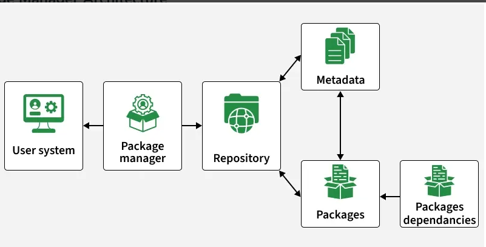

# Day 09 - Introduction to Package Managers and systemctl in Linux

## Objective

To understand how Linux package managers handle software installation, updates, and removal, and how systemctl is used to manage system services.

---

## What I Learned

- Package managers and systemctl are essential tools in Linux used to manage software and control system services

### Package Management in Linux

- Package managers are tools used to install, update, remove, and manage software.
- They also handle dependency resolution, ensuring all required packages are installed automatically.

### Functionalities of Package Manager

- Installation → Install software and dependencies
- Dependency Resolution → Automatically manage required libraries
- Upgrading → Keep software up to date
- Removal → Safely uninstall packages
- Querying → View package details and status

### Package Manager Architecture

A package manager interacts with the user system, repositories, packages, metadata, and dependencies to install and manage software.

- User System → Where commands are executed by users. The user runs commands like `apt install`, yum install, or dnf install

- Package Manager → Handles installation logic, update, removal and dependency handling. It 
processes user commands and communicates with repositories

- Repository → Stores packages. The package manager fetches required data from repositories

- Metadata → Information about packages

- Packages → Actual software files

- Dependencies → Required supporting packages

### Most Widely used Package Managers

1. APT (Debian/Ubuntu)
Default for Debian-based systems
Strong dependency resolution and repository management

Commands:

- Installing a package: `sudo apt-get update` 

- Updating the package list: `sudo apt-get install package-name`

- Upgrading packages: `sudo apt-get upgrade`

- Removing a package: `sudo apt-get remove package-name`

- Searching for packages: `apt-cache search package-name`

2. YUM (Red Hat Enterprise Linux /CentOS)
Used in Red Hat-based systems
Handles dependencies and repository interaction

Commands:

- Installing a package: `sudo yum install package-name`

- Updating the package list: `sudo yum makecache`

- Upgrading packages: `sudo yum update`

- Removing a package: `sudo yum remove package-name`

3. DNF (Fedora)
Successor to YUM
More modern and efficient

Commands:

- Installing a package: `sudo dnf install package-name`

- Updating packages: `sudo dnf upgrade`

4. DPKG (Debian Package Manager) : Low-Level Debian Tool
Works directly with .deb files
Does not handle dependencies automatically

Commands:

- Installing a package from a .deb file: `sudo dpkg -i package.deb`

- Removing a package: `sudo dpkg -r package-name`

- Querying package information: `dpkg -l | grep package-name`

### systemctl in Linux

systemctl is the primary command-line interface for interacting with systemd. 
systemctl Command is Used to control and monitor services.

What is systemd?
Systemd is a system and service manager for Linux operating systems responsible for:
    - Boot process
    - Service management
    - System monitoring

### Basic systemctl Commands
1. Starting and Stopping Services
 ` sudo systemctl start apache2` - To starte a service
 ` sudo systemctl stop apache2`  - To stop a service

 2. Enabling and Disabling Services
 `  sudo systemctl enable apache2` - To enable 
 `  sudo systemctl disable apache2`- To Disable

 3. Restarting and Reloading Services
`   sudo systemctl restart apache2`
`   sudo systemctl reload apache2`

4. Checking Service Status
` systemctl status apache2`

5. Viewing Active Units
` systemctl list-units --type=service`

---

## What I Built / Practiced

- Studied how package managers interact with repositories and dependencies
- Reviewed commands for installing, updating, and removing packages
- Explored the basic commands for systemctl
---

## Challenges Faced

- Lack of sudo privileges prevented:
    - Installing or removing packages
    - Managing system services using systemctl
- Practice was limited to conceptual understanding and command familiarity
---

## Key Takeaways

- Package managers are essential for efficient software management in Linux
APT, YUM, DNF, and DPKG each serve different distributions and use cases
- systemctl is critical for managing system services and processes
- Administrative privileges are required for most real-world operations
- Understanding these tools is fundamental for DevOps and system administration workflows
---

## Resources

-  https://www.geeksforgeeks.org/linux-unix/understanding-package-managers-and-systemctl/

---
