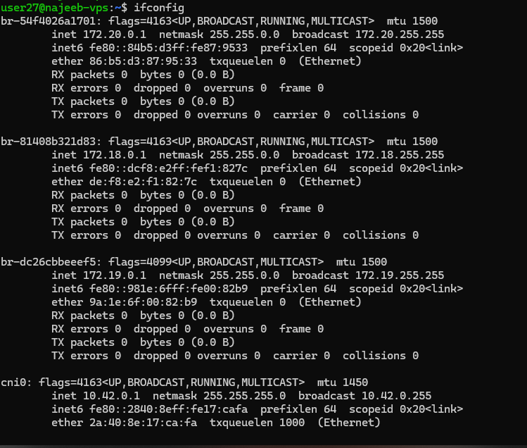

# Day 12 - Linux Networking (ifconfig Command)

## Objective

To understand how Linux network interfaces work and how to use the ifconfig command to view and analyze network configurations.

---

## What I Learned

### What is ifconfig?

- ifconfig is a Linux networking utility used to:
    - View network interface configurations
    - Adjust interface settings
    - Monitor network activity
- It provides key details such as:
    - IP address
    - MAC address
    - MTU (Maximum Transmission Unit)
    - Packet statistics (RX/TX)
- It is a legacy tool, now largely replaced by the ip command in modern systems.

### Key Network Interfaces

1. Ethernet Interface (e.g., eno1)
- Represents wired network connection
- Key attributes:
    - UP → Interface is active
    - RUNNING → Connection is established
    - inet → IPv4 address
    - ether → MAC address

2. Loopback Interface (lo)
- Represents the system itself (127.0.0.1)
- Used for:
    - Local testing
    - Running services internally

3. Wireless Interface (e.g., wlp0s20f3)
- Represents Wi-Fi connection
- Used for wireless communication

### Important Network Concepts
#### Private IP Address
- Used within internal networks
- Not accessible from the internet
- Ranges include:
    - 10.0.0.0 – 10.255.255.255
    - 172.16.0.0 – 172.31.255.255
    - 192.168.0.0 – 192.168.255.255

#### Public IP Address
- Globally accessible on the internet
- Assigned by ISPs
Used for:
    - Web hosting
    - APIs
    - Cloud services

Key `ifconfig` Commands
#### Display All Interfaces
`ifconfig`

#### Display All Interfaces (Including Down)
`ifconfig -a`

#### Short Output Format
`ifconfig -s`

#### Enable Interface
`ifconfig eth0 up`

#### Disable Interface
`ifconfig eth0 down`

#### Assign IP Address
`ifconfig eth0 192.168.1.10`

#### Set Netmask
`ifconfig eth0 netmask 255.255.255.0`

#### Set Broadcast Address
`ifconfig eth0 broadcast 192.168.1.255`

#### Change MAC Address
`ifconfig eth0 hw ether 00:1a:2b:3c:4d:5e`

### Viewing IP Address
#### Private IP
`ifconfig`
`hostname -I`

#### Public IP
`curl ifconfig.me`
`wget -qO- ifconfig.me`

---

## What I Built / Practiced

Checked My Network Interfaces using
`ifconfig`

to Identify
- Active interfaces
- Assigned IP addresses
- Network status

Extracted Only IP Address using
`ifconfig | awk '/inet / {print $2}'`

Checked my Private IP
hostname -I

---

## Challenges Faced

- Limited permissions prevented:
    - Enabling/disabling interfaces (ifconfig up/down)
    - Assigning IP addresses
    - Changing MAC address

---

## Key Takeaways

- ifconfig helps in network visibility and troubleshooting
- Understanding interfaces is critical for:
    - Debugging connectivity issues
    - System configuration
- Private and public IPs serve different roles in networking
- Modern Linux systems prefer the ip command, but ifconfig remains important for foundational learning

---

## Resources

- https://www.geeksforgeeks.org/linux-unix/ifconfig-command-in-linux-with-examples/

---

## Output

![ip's check]](image.png)
