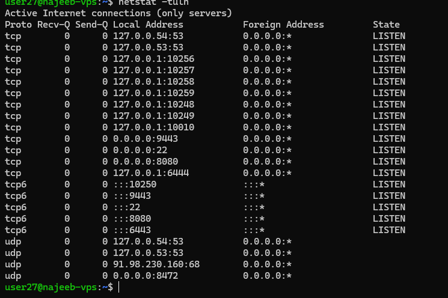
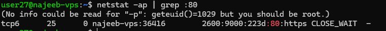
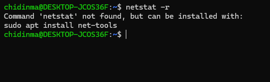

# Day 16 - Netstat Command in Linux

## Objective

To understand and apply the netstat command for monitoring network connections, inspecting open ports, analyzing routing tables, and diagnosing network-related issues in Linux systems.

This exercise builds foundational skills for network troubleshooting, system observability, and backend infrastructure monitoring.

---

## What I Learned

1. What is netstat?

netstat (Network Statistics) is a Linux command-line tool used to display detailed information about network activity on a system.

It is commonly used by system administrators and engineers to:

Inspect active network connections (TCP/UDP)
Identify listening services and open ports
View routing tables
Monitor network interface statistics
Associate processes (PID) with network ports

Note: netstat is considered deprecated in modern Linux distributions and is replaced by tools like ss, ip, and lsof.

#### to use the Netstat Command
1. View All Network Connectionsc : To understand the all network activities in a system, we use
    `netstat -a`
    - This displays all active connections

2. to show services waiting for incoming connections we use 
    `netstat -l`
 If a service is not accessible externally, the first check is whether it is in LISTEN state. we use the command to check for that. 

3. To filters only TCP-based connections. i.e Debugging HTTP, SSH, FTP services. we use 
    `netstat -t`

4. to Displays UDP-based communication: DNS, DHCP, streaming services. we use 
    `netstat -u`

5. To show Listening TCP/UDP Port
    `netstat -tuln`

6. To indetify which application is using a port, we use
    `netstat -ap | grep ssh`

7. Shows how packets are routed through the network.
    `netstat -r`

8. Displays packet counts, errors, and interface activity.
    ` `netstat -i`

Shows detailed statistics for TCP, UDP, IP, and other protocols.
statistics for TCP, UDP, IP, and other protocols.
netstat -s

---

## Key Takeaways

- netstat is essential for network diagnostics
- Helps map process → port → service behavior
- Critical for troubleshooting production failures
- Still heavily tested in interviews despite deprecation

## Resources

- https://www.geeksforgeeks.org/linux-unix/ip-command-in-linux-with-examples/

## Out put

- to show the list of TCP port:

- indentify processes using port 80:

## Challenge
can not run this because of sudo preveledge

- showing how packets are routed through the network

