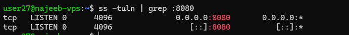

# Day 17 - SS Command in Linux (Socket Statistics)

## Objective

To understand and apply the `ss` command for inspecting network sockets, monitoring connections, analyzing listening services, and troubleshooting network issues in Linux systems.

This command is essential for modern Linux networking and is widely used in production environments and technical interviews.

---

## What I Learned

- What is `ss`?

`ss` (Socket Statistics) is a Linux utility used to display detailed information about network sockets.

It provides insights into:
- TCP and UDP connections
- Listening ports
- Routing-related socket states
- Process-to-socket mapping
- Network performance statistics

It is the modern replacement for `netstat` and is significantly faster and more efficient.

`ss` directly communicates with the Linux kernel instead of parsing large text files, making it ideal for production systems with high traffic.

ss commands in linux and their usage

- `ss` - list all sockets
- ss -t - filter and display only TCP sockets
- ss -u - shows only UDP sockets 
- ss -l - shows listing ports : services waiting for incomming connections
- ss -a - Used for full visibility of system network activity.
- ss -n - Display raw ips and ports
- ss -s -t -u - Display Summary Statistics for TCP and UDP

`ss sport = :22` - used to inspect sshtraffic for port 22

`ss -6` - Displays only IPV6 connections
---

## What I Built / Practiced

- chcek if API is running using `ss -tuln | grep :8080`

 

this shows that, a network service is actively listening on port 8080

When attempting to identify the actual APi runing on port 8080: using
`ss -tulnp | grep :8080`
we get this output:
user27@najeeb-vps:~$ ss -tulnp | grep :8080
tcp   LISTEN 0      4096              0.0.0.0:8080       0.0.0.0:*
tcp   LISTEN 0      4096                 [::]:8080          [::]:*

because the -p flag did not return the   process name.
- 

---

## Challenges Faced

- Due to lack of sudo privileges, I was unable to:
   used the -p flag did not return process name.

---

## Key Takeaways

- ss is the modern replacement for netstat
- It is faster because it communicates directly with the kernel
- Essential for debugging production network issues

---

## Resources

- https://www.geeksforgeeks.org/linux-unix/ss-command-in-linux/

---
