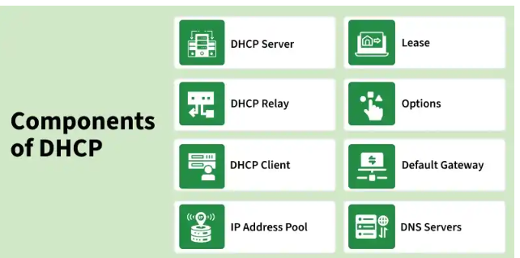

# Day 19 - Dynamic Host Configuration Protocol (DHCP)

The Dynamic Host Configuration Protocol (DHCP) is a network management protocol used to automatically assign IP addresses and other network configuration parameters to devices on a network.

It eliminates the need for manual configuration and ensures seamless connectivity across devices.

## Objective

To understand how DHCP automates IP address allocation, its internal workflow (DORA process), packet structure, and associated security implications within network systems.

---

## What I Learned

- DHCP is a client-server protocol that dynamically assigns IP addresses and network configurations to devices.
- The DORA process (Discover, Offer, Request, Acknowledge) defines the full lifecycle of IP allocation.
- DHCP operates over UDP using ports 67 (server) and 68 (client).
- Lease-based allocation ensures efficient reuse of IP addresses within a network.
- DHCP lacks built-in authentication, making it vulnerable to attacks such as starvation and rogue servers.

---

## What I Built / Practiced

- Analyzed the DHCP communication flow and mapped each stage of the DORA process.
- Studied DHCP packet structure and identified key fields such as Transaction ID, yiaddr, and Options.
- Explored real-world scenarios of DHCP usage in enterprise and cloud environments. 
---

## Challenges Faced

- Understanding how DHCP functions across different subnets required clarity on the role of DHCP Relay.
- Differentiating between similar DHCP messages (e.g., ACK vs NAK, Decline vs Release) initially caused confusion.
- Relating DHCP concepts to practical system design required deeper conceptual mapping.
- 

---

## Key Takeaways

- DHCP is a foundational network protocol critical for automated configuration in modern systems.
- The lease mechanism acts as a controlled resource allocation strategy.
- Security is a major concern due to lack of authentication; mitigation strategies must be implemented at the network level.
- DHCP behavior can be conceptually mapped to distributed systems and resource orchestration patterns.

---

## Resources

- https://www.geeksforgeeks.org/computer-networks/dynamic-host-configuration-protocol-dhcp/

---

## Output

