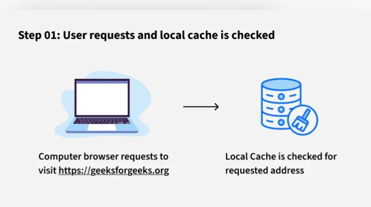
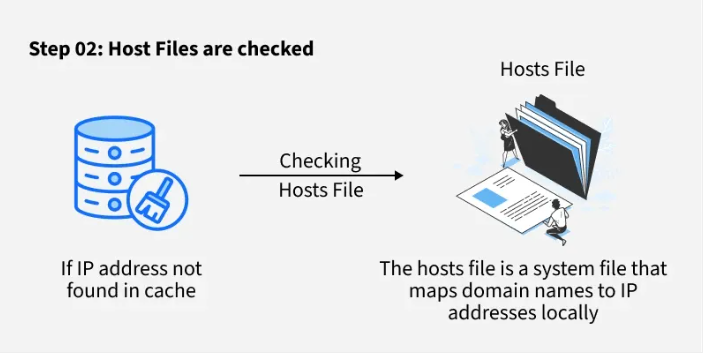
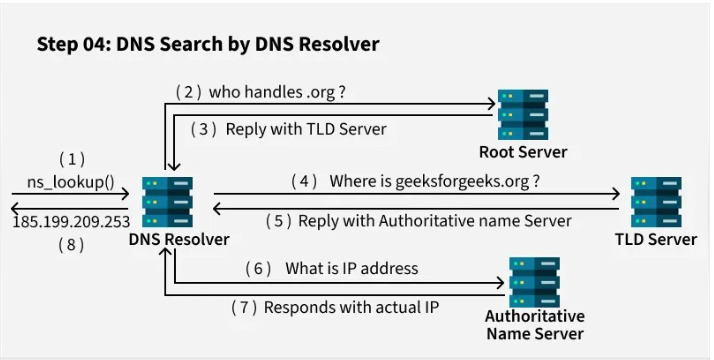
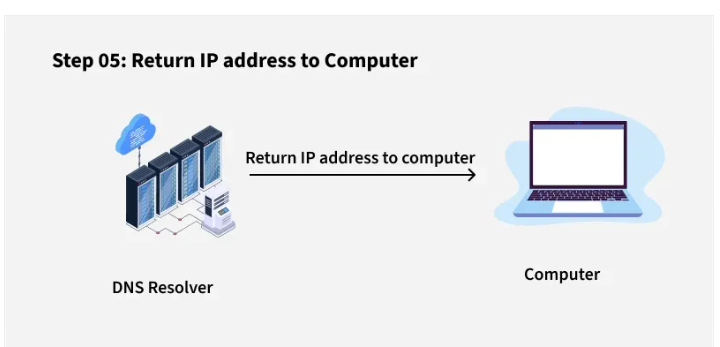

# Day 20 - Domain Name System (DNS)

## Objective

To understand how DNS translates domain names into IP addresses, its hierarchical structure, query types, caching mechanism, and its role in enabling internet communication.

---

## What I Learned

- The Domain Name System is a distributed and hierarchical system that resolves domain names to IP addresses.
- DNS resolution follows a multi-step process involving resolvers, root servers, TLD servers, and authoritative servers.
- DNS caching improves performance by storing previously resolved queries based on TTL (Time-to-Live).
- DNS queries can be recursive, iterative, or non-recursive depending on how resolution is handled.
- DNS supports both forward lookup (domain → IP) and reverse lookup (IP → domain using PTR records).
- DNS Record Types
Different DNS record types are used to store specific information about a domain.

    - A Record: Maps a domain name to its corresponding IPv4 address.
    -CNAME Record: Creates an alias that points one domain name to another domain name.
    - MX Record: Specifies the mail server responsible for receiving emails for a domain.
    - TXT Record: Stores text information used for verification and email authentication purposes.
- Traced the full DNS resolution workflow from user input to final IP response.
- Studied DNS hierarchy: Root → TLD → Second-Level Domain → Subdomain → Hostname.
- Analyzed different DNS record types (A, CNAME, MX, TXT, PTR) and their use cases.
- Explored how DNS caching and TTL reduce latency and server load.

---

---

## Key Takeaways

- DNS is a foundational component of the internet, acting as the “phonebook” of the web.
- The hierarchical structure enables global scalability and efficient domain management.
- Caching is critical for performance optimization and reducing redundant queries.
- TTL plays a key role in balancing freshness of data and system efficiency.
- DNS is essential for both web access and backend services like email routing and security validation.
- 

---

## Resources

- https://www.geeksforgeeks.org/computer-networks/domain-name-system-dns-in-application-layer/

--- 

