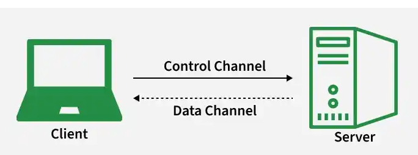

# Day 21 - File Transfer Protocol (FTP)

## Objective

To understand how FTP enables file transfer over TCP/IP networks, including its architecture, transmission modes, connection types, commands, and security limitations.

---

## What I Learned

### 1. What FTP Really Is

File Transfer Protocol (FTP) is an **application-layer protocol** used to transfer files between a client and a server over a TCP/IP network.

Core characteristics:

- Uses **TCP** for reliable communication  
- Supports transfer of **text, binary, images, and program files**  
- Enables **uploading, downloading, and remote file management**  
- Follows a **client–server architecture*

- ### How FTP Works (Core Architecture)

FTP operates using **two separate connections**:

####    Control Connection (Port 21)
- Handles commands and responses  
- Used for authentication (username & password)  
- Remains active throughout the session  

####    Data Connection (Port 20)
- Handles actual file transfer  
- Created per transfer request  
- Closes after transmission  

note : This design makes FTP an **out-of-band protocol**

### FTP Transmission Modes

- **ASCII Mode**
  - Used for text files  
  - Performs character conversion if needed  

- **EBCDIC Mode**
  - Used in IBM-based systems  

- **Image (Binary) Mode**
  - Default mode  
  - Transfers raw bytes without modification  

### FTP Data Types

- **ASCII** → Text-based files  
- **EBCDIC** → IBM encoding format  
- **Binary (Image)** → Raw data transfer (most used)  
- **Local** → Data with specific byte structure  

### FTP Client Operations

An FTP client:

- Connects to an FTP server  
- Authenticates user  
- Sends commands for file operations  
- Supports CLI or GUI interfaces  

### Common FTP Commands

- `get filename` → Download file  
- `mget filename` → Download multiple files  
- `put filename` → Upload file  
- `ls` → List directory contents  
- `cd` → Change directory  

### FTP Reply Codes (Interview Important)

| Code | Meaning |
|------|--------|
| 200 | Command successful |
| 221 | Service closing connection |
| 331 | Username accepted |
| 530 | Authentication failed |
| 502 | Command not implemented |

### Types of FTP

#### Anonymous FTP
- No authentication required  
- Read-only access  
- Used for public file distribution  

#### Password-Protected FTP
- Requires username/password  
- Controlled access  
- Supports full file operations  

#### FTPS (FTP Secure)
- Adds **SSL/TLS encryption**  
- Secures credentials and data  

#### SFTP (SSH File Transfer Protocol)
- Uses **SSH (port 22)**  
- Fully encrypted  
- Single connection (more secure)

### FTP Security Issues (Critical)

- Sends data in **plain text**
- Credentials are **not encrypted**
- Vulnerable to:
  - Sniffing  
  - Brute force attacks  
  - Spoofing  
  - Packet interception  

👉 Example risk:
Passwords like `Jerry1992` are transmitted exactly as typed.

---

### 10. FTP vs SFTP (Important Comparison)

| Feature | FTP | SFTP |
|--------|-----|------|
| Encryption |  No |  Yes |
| Port | 21 | 22 |
| Data Transfer | Plain text | Encrypted |
| Connections | Two (control + data) | Single |
| Protocol | TCP | SSH over TCP |

---

## Key Takeaways

- FTP is a **foundational file transfer protocol**
- Uses **two separate TCP connections**
- Not secure by default (plain text communication)
- SFTP and FTPS are preferred in modern systems
- Still important for **interviews and legacy systems**
- 

---

## Resources

- https://www.geeksforgeeks.org/computer-networks/file-transfer-protocol-ftp-in-application-layer/

---
