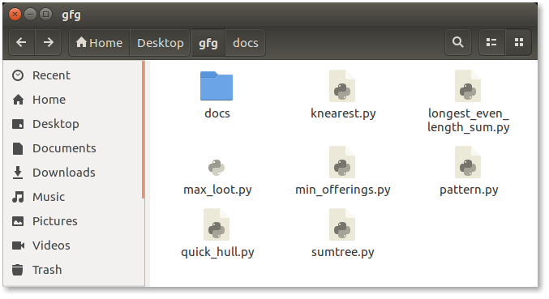
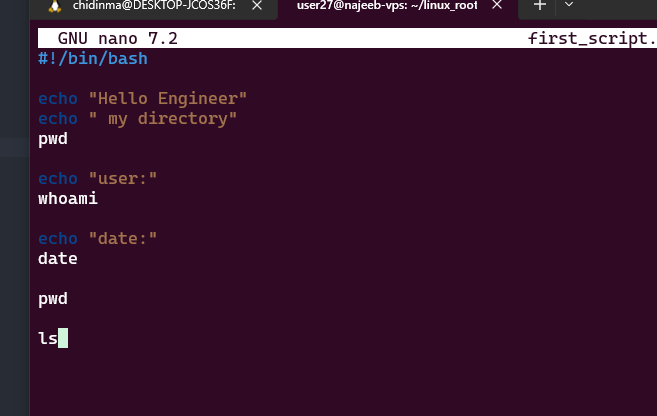
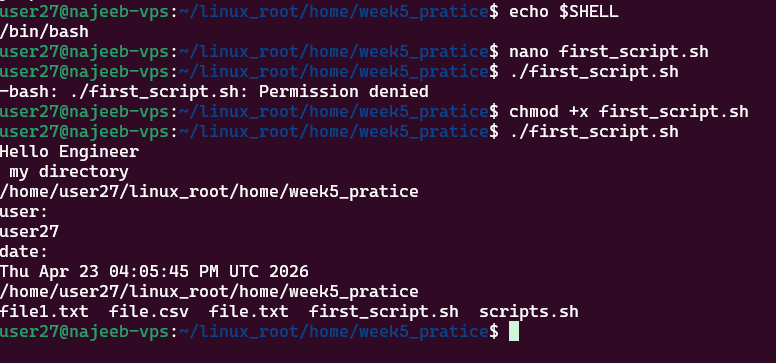
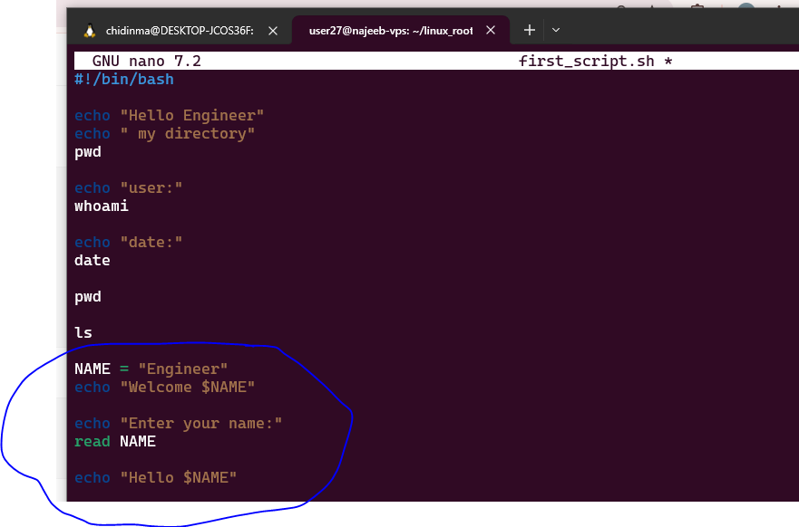
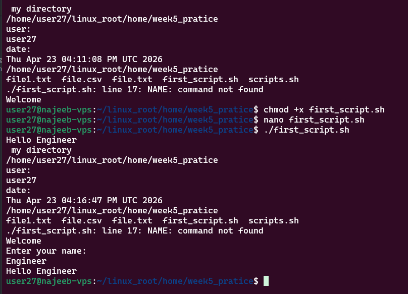

# Day 22 - Introduction to Linux Shell and Shell Scripting

## Objective

To understand the role of the Linux shell, its interaction with the operating system, and how shell scripting enables automation of repetitive tasks and efficient system management.

---

## What I Learned

#### What the Linux Shell Really Is

The Linux shell is a **command-line interpreter** that acts as an interface between the user and the operating system kernel.

Core responsibilities:

- Interprets user commands  
- Translates commands into system calls  
- Executes programs and scripts  
- Displays output or errors  

    Without the shell, users cannot interact effectively with the system.

### Core Components of Linux Environment

A Linux system is made up of layered components:

- **Terminal**
  - Provides a text-based interface  
  - Accepts user input and displays output  

- **Shell**
  - Interprets commands  
  - Acts as a bridge between user and kernel  

- **Kernel**
  - Core of the OS  
  - Manages hardware and system resources  

- **GNU Utilities & Libraries**
  - Provide essential commands (`ls`, `cp`, `mv`, etc.)

  ### Types of Shells

#### Command-Line Shell (CLI)

- Text-based interaction  
- Executes commands like `ls`, `pwd`, `cat`  
- Powerful but requires memorization  

#### Graphical Shell (GUI)

A Graphical Shell allows users to interact with the system through a Graphical User Interface (GUI). Instead of typing commands, users perform actions by clicking icons, opening windows, and using menus. Easier for beginners and Less powerful for automation 

###  Common Shell Programs in Linux

- **Bash (Bourne Again Shell)** → Default and most widely used  
- **Csh (C Shell)** → Syntax similar to C language  
- **Ksh (Korn Shell)** → Advanced scripting features

### What is Shell Scripting?

A shell script is a **text file containing a sequence of commands** that are executed automatically by the shell. And it allows users to automate repetitive tasks by combining multiple commands into a single file.

Example:

`myscript.sh`

### Advantages of Shell Scripting
- Automates repetitive Task
- Reliable and Consistent
- Integrates multiple commands easily
- Native Support on Unix/Linux Systems
- Lightweight and Easy to Write
- Widely used in DevOps and system monitoring

### Structure of a Shell Script
- Shebang
#!/bin/bash - this is a shell script
Specifies the interpreter

- Comments
line start with # is a comment
Used for documentation

- Commands
echo "Hello World"
pwd
ls -l

- Variables
MYDIR="/home/user/projects"
- Control Structures
Conditionals → if, else, case
Loops → for, while, until
- Functions

Reusable blocks of code:

function greet() {
    echo "Hello"
}

#### Example Script

#!/bin/bash

# Display current directory and list files

echo "Current Directory:"
pwd

echo "Files in Directory:"
ls -l

### Making Script Executable
chmod +x script.sh

### Persistent Script Usage

To make scripts available globally:

echo "source ~/script.sh" >> ~/.bashrc

## What I Built / Practiced

Created and executed basic shell scripts
Used commands like echo, pwd, ls inside scripts
Made scripts executable using chmod +x
Understood script structure (shebang, variables, control flow)
Explored function-based scripting (jump script concept)

---

---

## Key Takeaways

- The shell is the core interface for interacting with Linux
- Shell scripting enables automation and efficiency
- Scripts can simplify complex workflows
- Essential for:
  - System administration
  - DevOps
  - Data engineering pipelines
- 

---

## Resources

- https://www.geeksforgeeks.org/linux-unix/introduction-linux-shell-shell-scripting/

---

## Output

Made the script executable

including a viariable and accepting input

