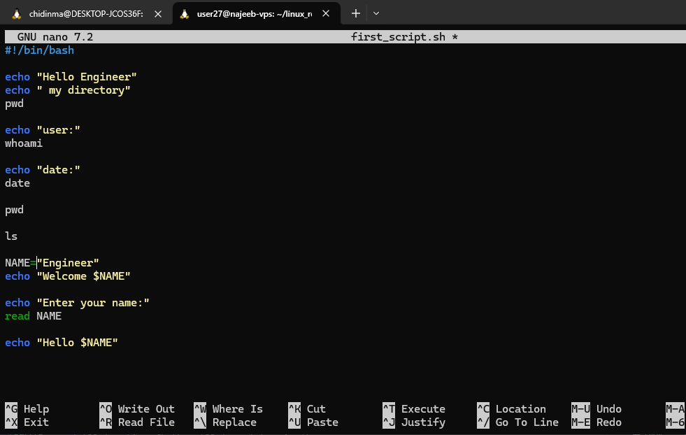
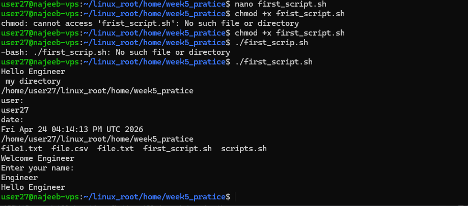
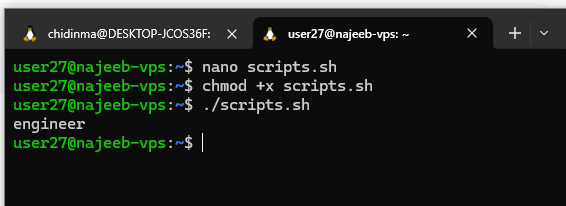

# Day 23 -  Define Bash Variables and its type

## Objective

To understand how Bash variables work, including their declaration, scope, types, and usage in building dynamic and reusable shell scripts.

---

## What I Learned

### 1. What Bash Variables Really Are

Bash variables are **named references used to store data** during script execution.

- Store text, numbers, command output, or arrays  
- Do not require explicit data types (untyped by default)  
- Enable dynamic and reusable scripts  

*Bash replaces variable names with their values during execution.*

### 2. How Bash Variables Work

- Bash reads script line by line  
- Identifies variables and their values  
- Substitutes variable names with actual values  
- Executes commands using those values  

Example:

Output:

*$myvar retrieves the stored value and whithout $, Bash would treat myvar as a literal string instead of a variable*

### 3. Naming Rules for Variables

- Must start with a letter or underscore
- Can contain letters, numbers, underscores
- Cannot contain special characters
- Case-sensitive (name, Name, NAME are different)

*Example"*:

    - name="value"
    - _user="value"
    - data1="value"

### 4. Local and Global Variable

#### Global Variables
#
A global variable is defined outside any function. It is accessible throughout the script, including inside functions (unless a local variable with the same name overrides it).

#!/bin/bash

myvar=5   # Global variable

function show() {
    echo "Inside function: $myvar"
}

show
echo "Outside function: $myvar"
    - The variable myvar is defined globally.
    - It can be accessed both inside and outside the function

#### Local Variables
A local variable is declared inside a function using the local keyword. It exists only during the execution of that function. Using local variable helps to prevent accidental modification of global variables.

#!/bin/bash

myvar=5   # Global variable

function calc() {
    local myvar=10   # Local variable
    (( myvar = myvar * 2 ))
    echo "Inside function (local): $myvar"
}
-
- The local variable myvar exists only inside calc.
- The global variable remains unchanged.
- Once the function finishes execution, the local variable is destroyed.

---

## What I Built / Practiced

- Created variables and used them in scripts
- Practiced variable naming rules
- Worked with:
    - Global and local variables
    - Environment variables
    - Special variables
- 

---

## Key Takeaways

- Variables make scripts dynamic and reusable
- Bash variables are untyped but flexible
- Special variables are critical for scripting
- Arrays allow handling multiple values efficiently
- Command substitution enables dynamic scripting
- 

---

## Resources
- https://www.geeksforgeeks.org/linux-unix/bash-script-define-bash-variables-and-its-types/