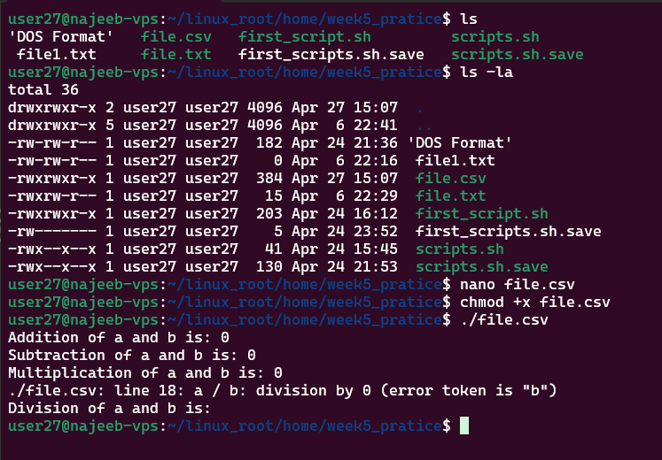
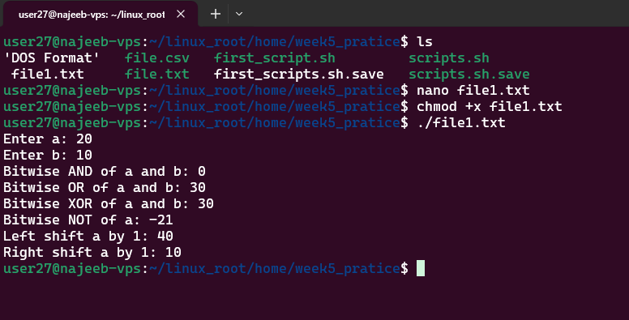

# Day 26 - Basic Operators in Shell Scripting

## Objective

To understand and apply different types of operators in Bash scripting, including arithmetic, relational, logical, bitwise, and file test operators, for building dynamic and decision-driven scripts.

---

## What I Learned

### What are Operators in Shell Scripting?

Operators are symbols used to perform operations on variables and values. They enable:

- Arithmetic calculations
- Logical decision-making
- Value comparisons
- File and directory validation

#### Types of Operators in Bash

### 2. Arithmetic Operators

Used for performing mathematical operations.

| Operator | Description |
|----------|------------|
| `+` | Addition |
| `-` | Subtraction |
| `*` | Multiplication |
| `/` | Division |
| `%` | Modulus |
| `++` | Increment |
| `--` | Decrement |

Example:

#!/bin/bash

a=10
b=5

echo "Addition: $((a + b))"

echo "Subtraction: $((a - b))"

echo "Multiplication: $((a * b))"

echo "Division: $((a / b))"

echo "Modulus: $((a % b))"

#### 3. Relational Operators

Used to compare numeric values (mainly inside (( ))).

Operator	Meaning
==	        Equal to
!=	        Not equal to
<	        Less than
<=	        Less than or equal
'>' Operator: Greater than operator 
'>=' Operator: Greater than or equal to operator

Example:

if (( a > b )); then
    echo "a is greater than b"
else
    echo "a is not greater than b"
fi

#### 4. Logical (Boolean) Operators

Used to combine multiple conditions.

Operator	Description
&&	AND

!	NOT

if [[ $a -gt 5 && $b -lt 10 ]]; then
    echo "Condition is true"
fi

#### 5. Bitwise Operators

Operate on binary representations of numbers.

Operator	Description

&	        AND

|           OR

<<	        Left shift

~	        NOT

^	        XOR

a=5
b=3

echo "AND: $((a & b))"

echo "OR: $((a | b))"

echo "XOR: $((a ^ b))"

#### 6. File Test Operators

Used to check file and directory properties.

Operator	Meaning

-e	File exists

-d	Is directory

-f	Is regular file

-r	Read permission

-w	Write permission

-x	Execute permission

-s	File not empty

---

## What I Built / Practiced

- Performed arithmetic operations using $(( ))

- Practiced bitwise operations for deeper understanding 

---

## Key Takeaways

- $(( )) is used for arithmetic operations
- (( )) is best for numeric comparisons
- [[ ]] is safer and more flexible for conditions
- File test operators are critical for writing robust scripts
- Operators are foundational for control flow (if, while, etc.)
---

## Resources

- https://www.geeksforgeeks.org/linux-unix/basic-operators-in-shell-scripting/

