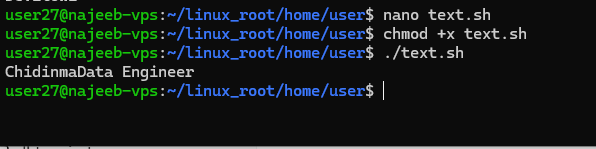
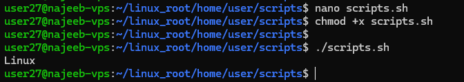
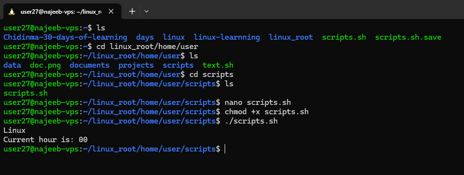
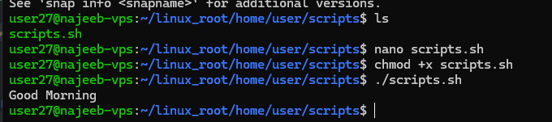

# Day 27 - Shell Scripting – Shell Variables

## Objective

To understand shell variables in Linux, including their types, scope, usage patterns, and rules for definition. The goal is to build foundational scripting competence for dynamic data handling, automation, and system-level scripting logic.

---

## What I Learned

- Concept of shell variables as runtime memory containers in Linux
- Difference between local, environment, and built-in variables
- Rules governing variable declaration and naming conventions
- Methods of accessing, modifying, and removing variables
- Importance of quoting, case sensitivity, and correct assignment syntax
- Use of special variables like $?, $1, $HOME, and $PATH

---

## What I Built / Practiced

- Wrote scripts using user-defined variables for input handling
- Practiced arithmetic operations using shell variables
- Implemented conditional logic using variables (time-based greetings)
- Used command substitution to store system outputs in variables
- Tested variable immutability using readonly
- Practiced variable removal using unset

---

## Challenges Faced

- Misunderstanding variable assignment syntax (spaces around =)
---

## Key Takeaways

- Shell variables are fundamental to Linux automation and scripting logic
- Correct syntax (var="value") is critical to avoid runtime errors
- Scope matters: local vs environment variables behave differently in processes
- Special variables provide system-level metadata essential for scripting
- Proper use of variables improves script flexibility and maintainability

---

## Resources

- https://www.geeksforgeeks.org/linux-unix/shell-scripting-shell-variables/

---

## Output

### Basic Variable Usage

### Readonly Variable

### common substitution

### Conditional Logic with Variables

