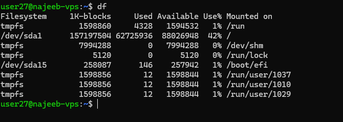
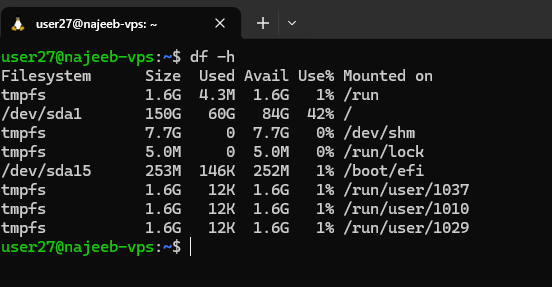
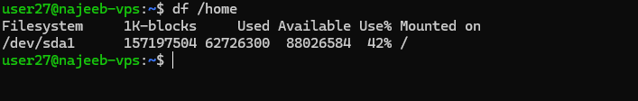
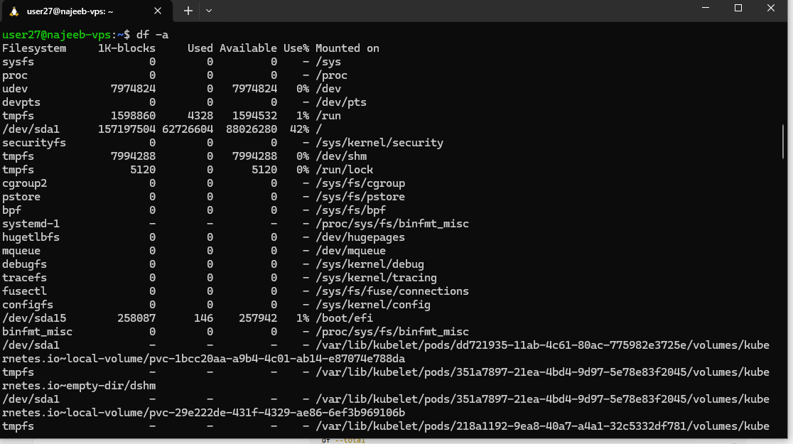

# Day 28 - Checking Disk Space using df

## Objective

Understand how to monitor and analyze disk space usage in Linux systems using the df command for effective storage management and system monitoring.

---

## What I Learned

- The df command is used to display disk space usage of mounted file systems
- It shows total space, used space, available space, and usage percentage
- It can target specific files, directories, or all mounted file systems
- Supports multiple options for filtering, formatting, and detailed analysis
- Helps in identifying storage issues such as low disk space or inode exhaustion

---

## What I Built / Practiced

- Checked disk usage across all mounted file systems using:

    - Using `df`

- Viewed human-readable disk usage: using `df -h`

- Checked disk usage for a specific directory: using `df /home`

- Practiced filtering and analyzing file systems using different options like:

    -a (all file systems)

    -i (inode usage)

    -t (specific file system type)

    -x (exclude file system type)
    
    -h ( human readable)

---

## Key Takeaways

- Always use df -h for quick and readable disk usage insights
- Disk space issues are not always about storage — inode exhaustion can also cause failures
- Filtering (-t, -x) helps focus on relevant file systems during troubleshooting
- df is essential for system monitoring, especially in production and DevOps environments

---

## Resources

- https://www.geeksforgeeks.org/linux-unix/df-command-in-linux/

---

## Output

- Display All File Systems (Including Hidden/Virtual)

