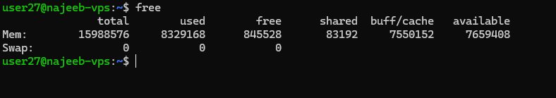
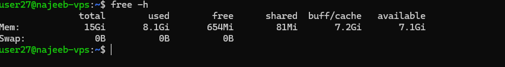
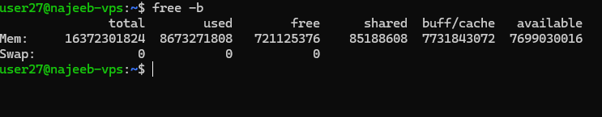

# Day 29 - Linux Command – free

## Objective

Understand how to monitor system memory usage in Linux using the free command for performance analysis, troubleshooting, and efficient resource management.

---

## What I Learned

- The free command displays memory usage including RAM and swap memory
- It shows key metrics: total, used, free, shared, buffers, cached, and available memory
- Default output is in KiB, but can be converted to human-readable formats
- Cached and buffered memory are reclaimable, not wasted
- The available field is the most accurate indicator of usable memory
- Supports continuous monitoring using -s and -c options

---

## What I Built / Practiced

- Checked memory usage using:

`free`

- Viewed memory in human-readable format:

`free -h`

- Practiced different units:

`free -m`

`free -g`

Monitored memory continuously:

`free -s 3 -c 3`

- Observed how buffer and cache affect memory interpretation

---

## Challenges Faced

- Initially misunderstood “used memory” as fully occupied RAM

---

## Key Takeaways

- Always rely on available memory, not just free, for accurate insight
- Cached memory improves performance and is reusable
- Use free -h for quick readability during troubleshooting
- Continuous monitoring (-s) is useful for observing memory trends
- free is a lightweight but essential tool for system performance analysis

---

## Resources

- https://www.geeksforgeeks.org/linux-unix/free-command-linux-examples/

---

## Output

- Display Memory Usage (Default)

- Human-Readable Format

- Display in Bytes

