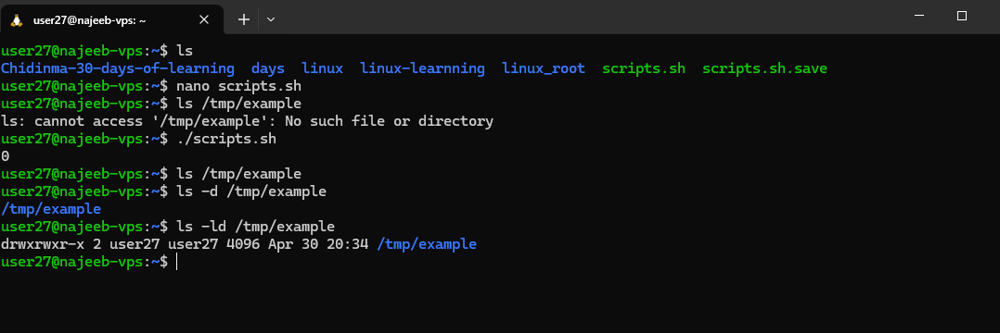
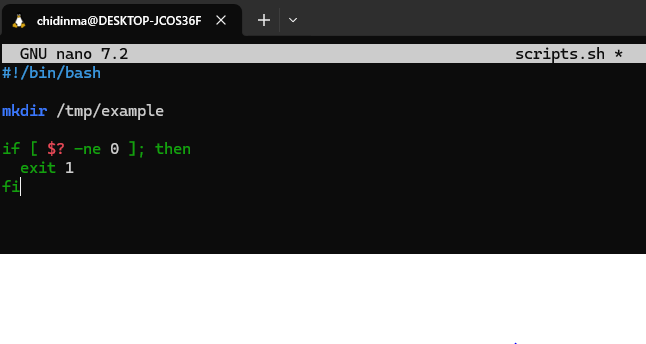
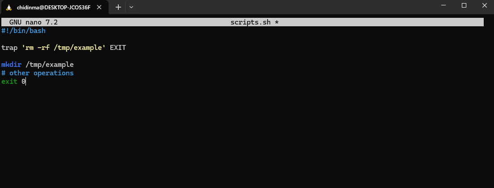

# Day 30 - Shell Scripting – Handling Script Failures in Bash

## Objective

Understand how to handle errors in Bash scripts using exit codes, control mechanisms, and best practices to ensure reliable, maintainable, and safe script execution.

---

## What I Learned

- Exit codes indicate success (0) or failure (1–255) of commands
- $? stores the exit status of the last executed command
- exit is used to terminate a script with a specific status code
- set -e automatically stops script execution on any error
- trap helps perform cleanup tasks when a script exits
- || exit 1 allows conditional stopping when specific commands fail
- Error messages can be captured using command substitution $(...)
- Errors can be suppressed using 2> /dev/null when not needed
---

## What I Built / Practiced

- Wrote scripts to:
    - Check command success using $?
    - Stop execution when a command fails using exit
    - Automatically exit on failure using set -e
    - Capture and display error messages using command substitution
- Implemented cleanup logic using trap
- Practiced selective failure handling using:
    - || exit 1
    - || true for non-critical commands
---

## Key Takeaways

- Always validate critical commands using $? or || exit 1
- Use set -e for strict scripts where any failure should stop execution
- Use trap to ensure cleanup tasks run regardless of success or failure
- Not all errors require termination — handle selectively
- Suppressing errors (2> /dev/null) should be used carefully
- Clear error messages improve debugging and script usability

---

## Resources

- https://www.geeksforgeeks.org/linux-unix/how-to-exit-when-errors-occur-in-bash-scripts/

---

## Output

### Check Exit Status

- output

- Techniques for Error Handling in Bash

### Exit on Failure

### : Using trap for Cleanup

